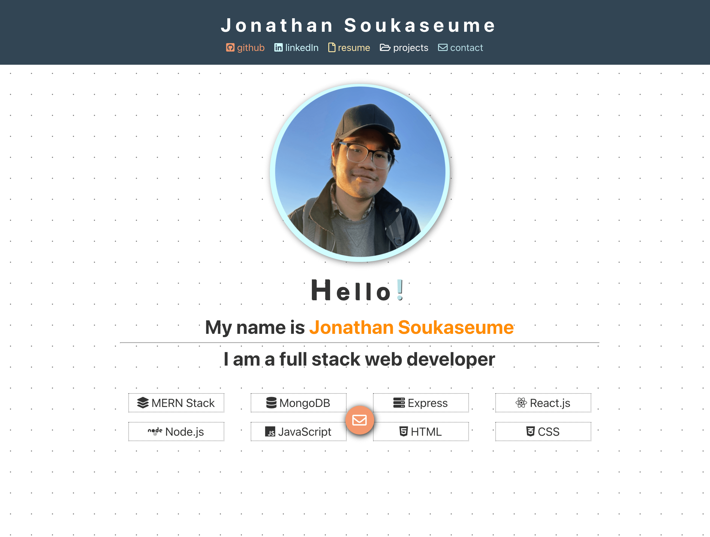
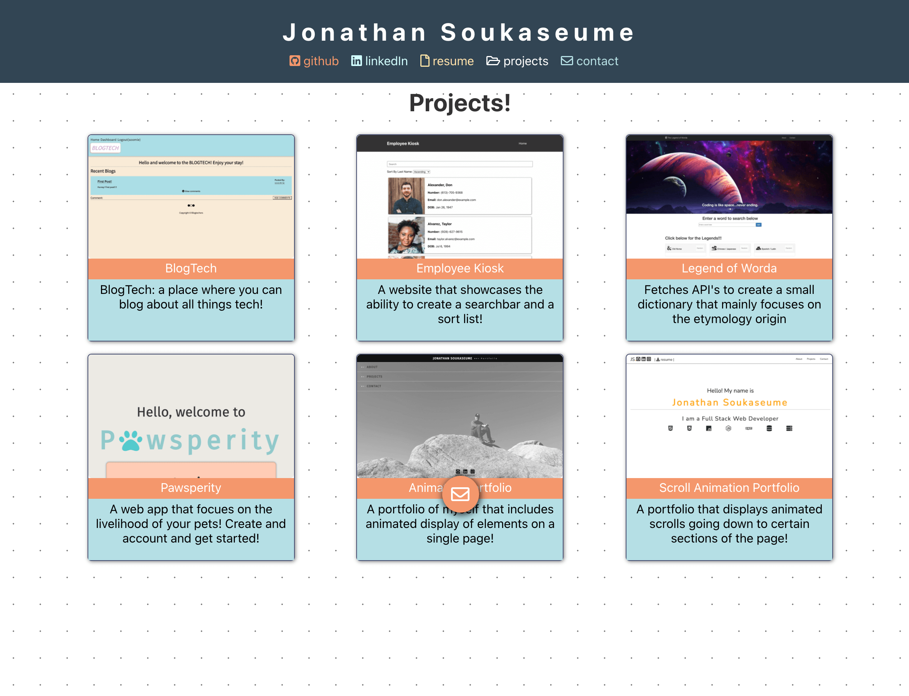
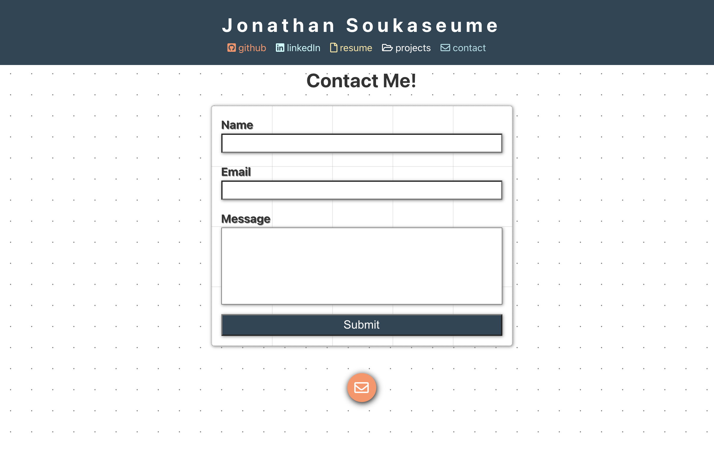

# MERN Stack Portfolio
## [MERN Stack Portfolio](#mern-stack-portfolio)
- [MERN Stack Portfolio](#mern-stack-portfolio)
  - [MERN Stack Portfolio](#mern-stack-portfolio-1)
  - [INTRODUCTIONS](#introductions)
  - [LINKS](#links)
  - [USAGE](#usage)
  - [CONTRIBUTIONS](#contributions)
  - [LICENSE](#license)
  - [SCREENSHOTS](#screenshots)

## INTRODUCTIONS
Hello and welcome to my portfolio github page! This is yet another rendition of my personal portfolio!

## LINKS
- [Portfolio Page]()
- [Github Page](https://github.com/sksmejn)

## USAGE 
Simpley head over to the [github pages]() and navigate around to view my links and contact information!

## CONTRIBUTIONS
I'm willing to take any suggestions!

## LICENSE 

## SCREENSHOTS

